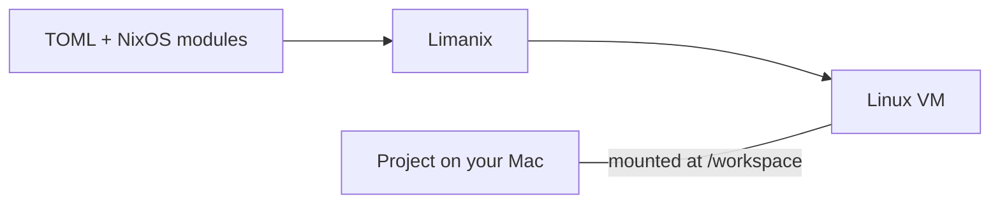

+++
title = "Limanix"
description = "Linux development environments on your Mac, configured with TOML and NixOS modules."
weight = 0
layout = "list"
next = "installation"

[cascade]
  type = "docs"
+++

Limanix runs your development environment in a Linux virtual machine on your
Mac. Describe its resources, tools, shared folders, and environment in a TOML
file. Edit your project on macOS; build, test, and run it inside NixOS.

Start with [Installation](installation.md), then follow
[Getting started](getting-started.md) to create your first VM.

## How it works

Limanix uses **Lima** to run the VM and provide networking and shared folders.
**NixOS** installs packages and configures the guest system. Both integrations
are part of Limanix; you do not need to install Lima or Nix on your Mac.

The guest user's home is also a directory on your Mac. Stopping or updating a VM
keeps its disk and home. Deleting a VM removes its disk but retains that home
unless you explicitly request its removal.


Shared folders are your real host files. Changes made through a read-write
mount are visible on both sides, including deletions.


## Find what you need

| If you want to… | Read |
| --- | --- |
| Install Limanix and choose the correct binary | [Installation](installation.md) |
| Create a VM and run your first command | [Getting started](getting-started.md) |
| Update a VM, share files, add tools, or expose a service | [Guide](guide/_index.md) |
| Start from a complete project configuration | [Examples](guide/examples.md) |
| Look up a field, flag, or storage location | [Reference](reference/_index.md) |
| Understand an error or recover a failed operation | [Troubleshooting](troubleshooting.md) |
| Work on Limanix itself | [Development](development/_index.md) |
