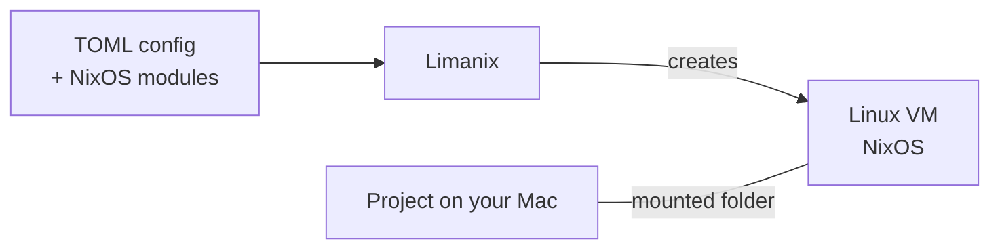

+++
title = "Limanix"
weight = 0
+++

# Limanix


**Build and test in Linux. Keep your project on your Mac.**

Limanix is a command-line tool for creating development sandboxes. Each sandbox
is a Linux virtual machine (VM) with the tools and packages your project needs.

Choose your tools with NixOS modules and describe the sandbox in a TOML config.
Share your local project folder with the VM, then build, test, and run services
inside it.

## Why use Limanix?

- **Keep project dependencies off your Mac.** Build and run your project inside
  the VM.
- **Make the setup clear.** Define packages and system settings in NixOS modules.
- **Work with your local files.** Share project folders and tool configs with
  the VM.

## How it works

Your `limanix.toml` describes the sandbox: VM resources, user, NixOS modules,
shared folders, environment variables, and network settings.



| Part | Role |
| --- | --- |
| **Limanix** | Turns your TOML config into settings for Lima and NixOS. |
| **Lima** | Runs the Linux VM and provides shared folders and networking. |
| **NixOS** | Sets up the system and packages using your modules. |

Inside the VM, you work as a regular user with `sudo` access by default. You can
also install packages manually; these changes belong to that VM.

> **Shared files stay on your Mac.** Mounted folders and the VM user's home use
> local storage. Changes in a read-write mount are visible on both sides.

## Install and start

Run Limanix on macOS 13 or newer. Its binary includes Lima's native driver,
host-agent support, and Linux guest agents. Release builds target Apple Silicon
(`arm64`) and Intel (`amd64`); host Lima, Python, and Nix are not required. See
[Getting started](getting-started.md#prerequisites) for binary installation and
building from source.

```console
limanix first-config
limanix modules list
```

Edit the generated `limanix.toml`: choose modules and replace or remove the
example mount sources. The managed host home defaults to `~/.limanix/<name>-<id>`.
For a native Intel guest, change `resources.arch` from its `arm64` default to
`amd64`.

```console
limanix create --config limanix.toml
limanix shell example-box
limanix update --config limanix.toml
```

## Explore the docs

Start with **[Getting started](getting-started.md)** to create a config and set up
your sandbox.
The configuration reference lists all fields and defaults; the CLI reference
covers commands and options.

You can also download
 with all default values.

### Use Limanix

- [Getting started](getting-started.md)
- [Development examples](examples.md)
- [Configuration](configuration.md)
- [CLI](cli.md)

### Develop Limanix

- [Go packages](api.md)
- [Source architecture](architecture.md)
- [Development and documentation](contributing.md)
