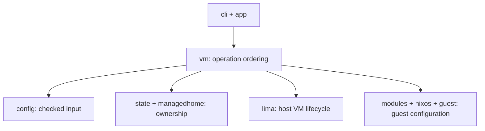

+++
title = "Architecture"
description = "Follow a command through VM orchestration, host state, Lima, and NixOS."
weight = 20
url = "/architecture/"
+++

Limanix is a Go CLI with two main responsibilities: translate a project
configuration into a Lima/NixOS VM, and retain enough host-owned state to manage
that VM safely across later commands.

## Follow a command

Read `cmd/limanix`, then `internal/cli`, `internal/app`, and `internal/vm`.
The CLI parses arguments and displays results. Application services construct
dependencies. The VM manager orders operations and decides when to persist state.



`domain` provides validated values shared by these packages. `filesystem`
provides checked paths and atomic writes. Neither defines CLI behavior.
For specific function contracts, see [Go packages](api.md).

## Source map

```text
cmd/
├── limanix/             CLI and hidden subprocess entry points
├── bundle-guestagent/   Build Linux guest-agent assets
├── bundle-socketvmnet/  Package upstream macOS network-helper assets
└── docsgen/             Generate model and command references
internal/
├── app/                 Construct runtime services lazily
├── cli/                 Command tree, arguments, output, and exit status
├── config/              TOML model, validation, defaults, and rendering
├── domain/              Shared validated values and lifecycle records
├── vm/                  Create, update, delete, and lifecycle orchestration
├── state/               Identity/runtime records, archives, and locks
├── managedhome/         Create and remove the exact owned host home
├── modules/             Import and resolve trusted module trees
├── nixos/               Assemble guest generations from embedded Nix sources
├── guest/               Apply generations, open sessions, discover addresses
├── lima/                Lima schema, drivers, store, and lifecycle adapter
├── hostagent/           Persistent Lima host-agent subprocess
├── vmnet/               Confirmed privileged network setup
├── bundle/              Embedded agents/helper and runtime extraction
│   ├── generator/       Build and verify Linux guest agents
│   └── vmnetgen/        Download and verify macOS helper archives
├── buildinfo/           Release identity and macOS compatibility baseline
├── filesystem/          Checked paths and durable atomic writes
└── docs/generator/      Generated references, example TOML, and site metadata
```

## Create and update

Creation validates input and host prerequisites before allocating the managed
home and identity. It prepares a self-contained generation, creates the Lima
instance, starts it, applies NixOS, and saves the ready state.

An update retains identity and storage. It prepares a new generation, checks
Lima's current status again, stops a running VM, applies Lima settings, and
starts the guest. The guest adapter installs environment files, runs
`nixos-rebuild boot`, reboots, and checks access as the development user.

Environment files sit beside the generation's flake, outside its Nix source.
Their values are installed under `/etc/limanix` before the rebuild. They are
readable by guest users; this is not secret isolation.

A failed operation retains the recorded diagnostic and recovery state once
backend creation or update has begun. A successful update prunes previous
configuration generations. Cleanup warnings do not change that success into a
failure. Recovery behavior is described in [Troubleshooting](/troubleshooting.md).

## Ownership and persistence

The immutable `identity.json` ties the public VM name to a generated Lima name,
validated guest user, and exact managed-home allocation. The separate
`instance.json` stores operation state and generation metadata. Neither uses
files in the guest home as proof of ownership.

Deletion uses the identity even if the runtime record is damaged. It removes
Lima's instance and Limanix records. Normal deletion archives home ownership
first; `--remove-home` instead removes the exact recorded allocation after
checking its paths. External mount sources are not separate deletion targets.
See [State and storage](/reference/storage.md) for paths and listing semantics.

## Concurrency boundaries

Each VM has an exclusive operation lock. Listing checks that lock to distinguish
an active unfinished operation from an interrupted one, without changing the
saved record.

The module registry uses shared locks while listing or copying selected sources
into a generation. Imports and removals use an exclusive lock; conflicts wait
for up to 30 seconds. Module copying finishes before a guest Nix build begins.

Limanix also serializes its own network lifecycle calls within one `LIMA_HOME`.
This is not a lock shared with external `limactl` processes or other Lima homes.
Lima owns the helper lifecycle; see the
[shared-network limits](/guide/networking.md#shared-network-lifecycle).

## Host and guest boundaries

Lima's Go APIs handle schema validation, instance storage, VZ/QEMU drivers, and
VM lifecycle. Lima launches the same Limanix executable as a hidden host-agent
subprocess. `hostagent` owns that process's PID lease, API socket, synchronized
JSON logs, and signal-driven shutdown.

Sessions use the system SSH client with Lima's connection settings. Management
commands use `limanix-admin`; user sessions switch to the configured development
account. Management access does not depend on `user.sudo`.

Address discovery has a five-second child context. SSH connections use
`ConnectTimeout=10`; management commands and NixOS rebuilds have no extra overall
execution deadline. A failed address probe leaves that row's address empty.

## Build-time boundaries

The application embeds NixOS sources, bundled modules, compressed Linux guest
agents, and upstream socket_vmnet archives. Their generators run before Go
compiles the binary; runtime packages do not depend on those generators.

Guest-agent validation covers linked dependencies, compiler/build settings,
archive hashes, ELF architecture, and the absence of a dynamic loader.
Uncompressed build output lives in a system temporary directory outside embedded
resources. Helper validation covers pinned archive bytes, Mach-O architecture,
library dependencies, and the macOS deployment target.

See [Building Limanix](builds.md) for the release inputs and update procedures,
and [Writing documentation](documentation.md) for the independent docs pipeline.
